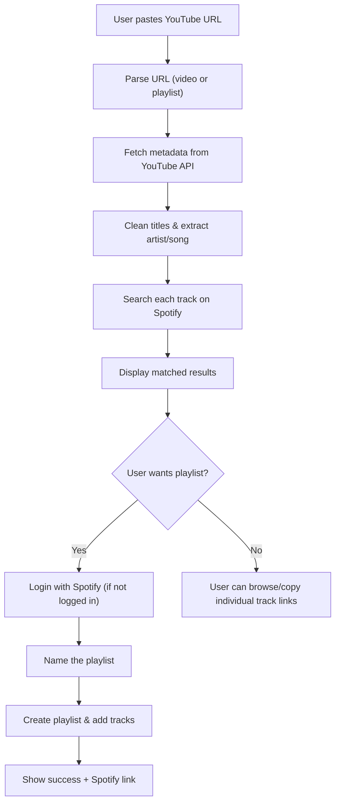

# YouTube → Spotify Converter

Convert YouTube playlists and songs into Spotify tracks — paste a link, find matches, and optionally create a Spotify playlist.

## Tech Stack

| Layer | Technology |
|---|---|
| Framework | **Next.js 15** (App Router, TypeScript) |
| UI | **ShadCN UI** + Tailwind CSS |
| YouTube | **YouTube Data API v3** (`googleapis` npm package) |
| Spotify Auth | **NextAuth.js** (Spotify OAuth provider) |
| Spotify API | Direct `fetch` calls to Spotify Web API |
| URL Parsing | Manual regex (no extra dependency needed) |

---

## User Review Required

> [!IMPORTANT]
> **API Keys Required** — You will need to set up:
> 1. **Google Cloud Console** → Enable YouTube Data API v3 → Create an API Key
> 2. **Spotify Developer Dashboard** → Create an App → Get Client ID & Client Secret
> 3. Set redirect URI to `http://127.0.0.1:3000/api/auth/callback/spotify` for local dev

> [!WARNING]
> **Spotify Development Mode** limits your app to **25 authorized users**. For broader access, you'll need to apply for Extended Quota Mode on the Spotify Developer Dashboard. For personal/portfolio use, 25 users is fine.

---

## Open Questions

> [!IMPORTANT]
> **1. Song matching strategy** — YouTube video titles are messy (e.g. `"Artist - Song (Official Video) [4K]"`). I plan to implement a title-cleaning algorithm that strips common noise words like `(Official Video)`, `[Lyrics]`, `(Audio)`, etc., then searches Spotify with the cleaned title. Is this acceptable, or do you want a more advanced matching approach?

> [!IMPORTANT]
> **2. Spotify login requirement** — Searching Spotify's API now requires authentication (as of 2025). This means users must log in with Spotify even just to *search* for matches. Should we:
> - **(A)** Require Spotify login upfront (simpler, consistent UX)
> - **(B)** Use a server-side Client Credentials flow for search (no user login needed for searching, only for playlist creation)
>
> I recommend **(B)** — search without login, only require login when creating a playlist.

> [!IMPORTANT]
> **3. Deployment target** — Any preference? Vercel is the most natural fit for Next.js (free tier, zero-config). Otherwise we can use any Node.js host.

---

## Proposed Changes

### Phase 1: Project Scaffolding

#### [NEW] Next.js Project Initialization

```bash
npx -y create-next-app@latest ./ --typescript --tailwind --eslint --app --src-dir --no-import-alias
npx shadcn@latest init
npx shadcn@latest add button input card dialog scroll-area toast progress badge skeleton separator alert
```

#### [NEW] `.env.local`
Environment variables for API keys and OAuth:
```env
YOUTUBE_API_KEY=your_youtube_api_key
SPOTIFY_CLIENT_ID=your_spotify_client_id
SPOTIFY_CLIENT_SECRET=your_spotify_client_secret
NEXTAUTH_URL=http://127.0.0.1:3000
NEXTAUTH_SECRET=your_random_secret
```

#### [NEW] `.env.example`
Template file (committed to git) with placeholder values.

---

### Phase 2: Core Architecture

```
src/
├── app/
│   ├── layout.tsx              # Root layout with providers
│   ├── page.tsx                # Home page (URL input + results)
│   ├── globals.css             # Tailwind + custom styles
│   └── api/
│       ├── auth/[...nextauth]/
│       │   └── route.ts        # NextAuth Spotify OAuth
│       ├── youtube/
│       │   └── route.ts        # YouTube metadata extraction endpoint
│       └── spotify/
│           ├── search/
│           │   └── route.ts    # Spotify track search endpoint
│           └── playlist/
│               └── route.ts    # Create playlist + add tracks endpoint
├── components/
│   ├── ui/                     # ShadCN components (auto-generated)
│   ├── url-input.tsx           # YouTube URL input with validation
│   ├── track-list.tsx          # List of matched tracks
│   ├── track-card.tsx          # Individual track with match status
│   ├── conversion-progress.tsx # Progress bar during conversion
│   ├── spotify-login.tsx       # Spotify auth button
│   ├── playlist-creator.tsx    # Dialog to name & create playlist
│   ├── header.tsx              # App header/navbar
│   └── providers.tsx           # Session + Toast providers
├── lib/
│   ├── youtube.ts              # YouTube API helpers
│   ├── spotify.ts              # Spotify API helpers
│   ├── url-parser.ts           # YouTube URL parsing (regex)
│   ├── title-cleaner.ts        # Clean YouTube titles for better matching
│   └── auth-options.ts         # NextAuth configuration
└── types/
    └── index.ts                # TypeScript interfaces
```

---

### Phase 3: API Layer

#### [NEW] `src/lib/url-parser.ts`
Regex-based extraction of YouTube video IDs and playlist IDs from various URL formats:
- `youtube.com/watch?v=VIDEO_ID`
- `youtu.be/VIDEO_ID`
- `youtube.com/playlist?list=PLAYLIST_ID`
- `youtube.com/watch?v=VIDEO_ID&list=PLAYLIST_ID`

#### [NEW] `src/lib/youtube.ts`
Functions using `googleapis`:
- `getVideoDetails(videoId)` → Fetch title, channel, duration
- `getPlaylistItems(playlistId)` → Paginated fetch of all videos in a playlist (handles `nextPageToken`)
- Returns cleaned metadata ready for Spotify search

#### [NEW] `src/lib/title-cleaner.ts`
Cleans YouTube video titles for better Spotify matching:
- Strips patterns: `(Official Video)`, `[Lyrics]`, `(Audio)`, `[HD]`, `[4K]`, `| Official Music Video`, etc.
- Attempts to split `"Artist - Song Title"` format
- Removes featuring tags and normalizes them: `ft.`, `feat.`, `featuring` → standardized format

#### [NEW] `src/lib/spotify.ts`
Functions using direct `fetch`:
- `getClientCredentialsToken()` → Server-side token for search (no user login)
- `searchTrack(title, artist, token)` → Search Spotify for best match
- `createPlaylist(name, userId, token)` → Create a new playlist
- `addTracksToPlaylist(playlistId, trackUris, token)` → Batch add tracks (100 max per request)

#### [NEW] `src/lib/auth-options.ts`
NextAuth configuration with Spotify provider:
- Scopes: `playlist-modify-public`, `playlist-modify-private`, `user-read-private`
- Token refresh handling
- Session callback to expose access token

---

### Phase 4: API Routes

#### [NEW] `src/app/api/auth/[...nextauth]/route.ts`
NextAuth route handler for Spotify OAuth (login, callback, session).

#### [NEW] `src/app/api/youtube/route.ts`
`POST` handler:
- Accepts `{ url: string }`
- Parses URL → determines if video or playlist
- Fetches metadata from YouTube API
- Returns `{ type: 'video' | 'playlist', tracks: Track[] }`

#### [NEW] `src/app/api/spotify/search/route.ts`
`POST` handler:
- Accepts `{ tracks: { title: string, artist: string }[] }`
- Uses Client Credentials flow (no user auth needed)
- Searches each track on Spotify
- Returns matched results with confidence indicators

#### [NEW] `src/app/api/spotify/playlist/route.ts`
`POST` handler (requires user auth):
- Accepts `{ name: string, trackUris: string[] }`
- Creates a new Spotify playlist
- Adds all matched tracks
- Returns playlist URL

---

### Phase 5: UI Components & Page

#### [NEW] `src/components/header.tsx`
- App logo/title
- Spotify login/logout button
- Clean, minimal design

#### [NEW] `src/components/url-input.tsx`
- Large, prominent input field for YouTube URL
- URL validation (real-time feedback)
- "Convert" button with loading state
- Supports both video and playlist URLs

#### [NEW] `src/components/track-list.tsx`
- Scrollable list of matched tracks
- Summary stats (X matched, Y not found)
- "Select All" / "Deselect All" controls
- "Create Spotify Playlist" button (appears when tracks are matched)

#### [NEW] `src/components/track-card.tsx`
- YouTube title on one side, Spotify match on the other
- Match confidence badge: `Exact Match`, `Partial Match`, `Not Found`
- Checkbox for selection
- Link to open in Spotify
- Album art thumbnail from Spotify

#### [NEW] `src/components/conversion-progress.tsx`
- Progress bar showing conversion status
- "Searching track 3 of 50..." text
- Animated state

#### [NEW] `src/components/playlist-creator.tsx`
- Dialog/modal to name the new playlist
- Option for public/private
- Confirmation with track count
- Success state with link to open in Spotify

#### [NEW] `src/app/page.tsx`
Main page assembling all components:
1. **Hero section** — App title, description, URL input
2. **Results section** — Track list with matches (appears after conversion)
3. **Action section** — Create playlist button + Spotify login prompt

---

### Phase 6: Polish & UX

- **Loading states**: Skeleton cards while fetching
- **Error handling**: Toast notifications for API errors, invalid URLs
- **Responsive design**: Mobile-first, works on all screen sizes
- **Dark mode**: Default dark theme (modern, Spotify-like feel)
- **Animations**: Smooth transitions on track list appearance, progress updates

---

## App Flow Diagram



---

## Verification Plan

### Automated Tests
- URL parser: Unit tests for all YouTube URL formats
- Title cleaner: Unit tests with real-world messy titles
- API routes: Integration tests with mocked API responses
- Run with: `npm test`

### Manual Verification
1. Paste a YouTube video URL → verify correct track found on Spotify
2. Paste a YouTube playlist URL → verify all tracks resolved
3. Create a Spotify playlist → verify it appears in user's Spotify account
4. Test error cases: invalid URLs, private playlists, API failures
5. Test responsive design on mobile viewport
6. Verify dark mode styling

### Dev Server
```bash
npm run dev
# Open http://localhost:3000
```
