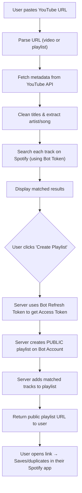

# YouTube → Spotify Converter

Convert YouTube playlists and songs into Spotify tracks — paste a link, and get back a public Spotify playlist link you can save to your own library. No user login required.

## Tech Stack

| Layer | Technology |
|---|---|
| Framework | **Next.js 15** (App Router, TypeScript) |
| UI | **ShadCN UI** + Tailwind CSS |
| YouTube | **YouTube Data API v3** (`googleapis` npm package) |
| Spotify Auth | **Bot Account Refresh Token** (server-side only, no user OAuth) |
| Spotify API | Direct `fetch` calls to Spotify Web API |
| URL Parsing | Manual regex (no extra dependency needed) |

---

## Architecture Overview

Instead of requiring users to log in with their own Spotify accounts (which is limited to 25 whitelisted users in Spotify's Development Mode), the app uses a **dedicated bot Spotify account** owned by the developer.

**How it works:**
1. Developer pre-authenticates the bot account once and saves the **Refresh Token** to environment variables.
2. When a user requests a conversion, the server uses the Refresh Token to get a short-lived Access Token.
3. The server creates a **public playlist** on the bot account and adds the matched tracks.
4. The user receives the public Spotify playlist link and can open it, save it, or duplicate the tracks into their own library — no login required.

```
User (no login) → Our Server → Bot Spotify Account → Public Playlist Link → User
```

---

## User Review Required

> [!IMPORTANT]
> **API Keys Required** — You will need to set up:
> 1. **Google Cloud Console** → Enable YouTube Data API v3 → Create an API Key
> 2. **Spotify Developer Dashboard** → Create an App → Get Client ID & Client Secret
> 3. **One-time bot account authorization** → Run the helper script to get the bot account's Refresh Token (see below)

> [!IMPORTANT]
> **Bot Account Setup (One-Time)** — Before running the app you need to:
> 1. Create a dedicated Spotify account (or use your own, but a dedicated one is cleaner).
> 2. Add it to the Spotify app's "Users and Access" whitelist in Development Mode.
> 3. Run the included `scripts/get-refresh-token.mjs` script to authorize the account and capture the Refresh Token.
> 4. Set `SPOTIFY_BOT_REFRESH_TOKEN` in `.env.local`.

> [!WARNING]
> **Playlist Accumulation** — The bot account will accumulate playlists over time. A background cleanup job (Phase 7) should delete playlists older than 30 days. Until then, manual cleanup will be needed.

> [!WARNING]
> **Rate Limiting** — If the app becomes heavily used, Spotify may throttle the bot account. We should add server-side rate limiting (e.g., max 5 concurrent conversions) to prevent abuse.

---

## Open Questions

> [!IMPORTANT]
> **1. Playlist retention policy** — How long should converted playlists live on the bot account before being deleted? Suggested: **30 days**. We can store creation timestamps in a simple JSON file or a database.

> [!IMPORTANT]
> **2. Deployment target** — Vercel is the most natural fit for Next.js (free tier, zero-config). The bot Refresh Token goes in Vercel's environment variables. Is Vercel acceptable?

---

## Proposed Changes

### Phase 0: Refactor — Remove User Auth (NextAuth)

The existing code already has NextAuth and Spotify OAuth wired up. We need to rip that out and replace it with bot account logic.

#### [MODIFY] `src/lib/auth-options.ts` → [DELETE]
Remove entirely. We no longer need NextAuth.

#### [MODIFY] `src/app/api/auth/[...nextauth]/route.ts` → [DELETE]
Remove entirely. No OAuth callback needed.

#### [MODIFY] `src/components/providers.tsx`
Remove `SessionProvider`. Keep only `Toaster`.

#### [MODIFY] `src/components/spotify-login.tsx` → [DELETE]
Remove entirely. No user login UI needed.

#### [MODIFY] `src/components/header.tsx`
Remove Spotify login/logout button. Simplify to just app logo/title.

#### [MODIFY] `src/components/playlist-creator.tsx`
Remove public/private toggle (all playlists are public by default since they're on the bot account).
Remove "login required" gating — the "Create Playlist" button is always available.
Update success state to show a prominent "Open in Spotify" link + a note explaining the user can save/duplicate the playlist.

#### [MODIFY] `package.json`
Remove `next-auth` dependency.

---

### Phase 1: Bot Account Authentication

#### [NEW] `scripts/get-refresh-token.mjs`
A **one-time-run** Node.js script (run locally by the developer) that:
1. Opens a local HTTP server on port 3000.
2. Prints an authorization URL to visit in the browser.
3. Handles the OAuth callback and exchanges the code for tokens.
4. Prints the `refresh_token` to the terminal to be copied into `.env.local`.

```
node scripts/get-refresh-token.mjs
# → Visit this URL to authorize: https://accounts.spotify.com/authorize?...
# → Got refresh token: AQD...
# → Add SPOTIFY_BOT_REFRESH_TOKEN=AQD... to your .env.local
```

#### [MODIFY] `src/lib/spotify.ts`
Replace `getClientCredentialsToken()` with:
- `getBotAccessToken()` — Uses the saved `SPOTIFY_BOT_REFRESH_TOKEN` env var to call `https://accounts.spotify.com/api/token` with `grant_type=refresh_token`. Returns a fresh access token. Should cache the token in memory and only refresh when expired (< 60s remaining).
- `getBotUserId()` — Calls `GET /me` using the bot access token. Cached after first call.
- `createPlaylist(name, description, token, userId)` — Creates a **public** playlist on the bot account.
- `addTracksToPlaylist(playlistId, trackUris, token)` — Unchanged.
- `searchTrack(title, artist, token)` — Unchanged (was already using Client Credentials; now uses bot token instead, which is fine).

#### [MODIFY] `.env.local` / `.env.example`
Remove:
- `NEXTAUTH_URL`
- `NEXTAUTH_SECRET`

Add:
- `SPOTIFY_BOT_REFRESH_TOKEN=your_bot_account_refresh_token`

---

### Phase 2: API Route Updates

#### [MODIFY] `src/app/api/spotify/playlist/route.ts`
- **Remove** authentication check (no longer requires user session).
- Use `getBotAccessToken()` and `getBotUserId()` instead of session token.
- Create the playlist as **public** on the bot account.
- Return: `{ playlistId, playlistUrl, playlistName, trackCount }`.

#### [MODIFY] `src/app/api/spotify/search/route.ts`
- Replace `getClientCredentialsToken()` calls with `getBotAccessToken()`.
- No other changes needed.

#### [MODIFY] `src/app/api/youtube/route.ts`
- No auth changes needed. Unchanged.

---

### Phase 3: UI Updates

#### [MODIFY] `src/components/playlist-creator.tsx`
Key UX changes:
- **Remove** "Login with Spotify" gating — button is always clickable.
- **Remove** public/private toggle.
- **Add** explanatory copy: *"A public playlist will be created on our account. Use the link below to open it in Spotify and save it to your library."*
- **Add** visual instructions in the success state:
  1. Click the link to open the playlist in Spotify.
  2. Click the **"Save"** button (❤️ / +) to add it to your library.
  3. Or select all tracks and add them to any of your playlists.

#### [MODIFY] `src/components/track-list.tsx`
- Remove any references to Spotify session/login state.
- "Create Spotify Playlist" button is always enabled after tracks are matched.

#### [MODIFY] `src/app/page.tsx`
- Remove session/auth state management.
- Remove any conditional rendering based on login state.

---

### Phase 4: Playlist Cleanup (Optional, Phase 7)

> [!NOTE]
> This is a nice-to-have. Lower priority. The bot account will accumulate playlists indefinitely until this is implemented.

#### [NEW] `src/app/api/cleanup/route.ts`
A `GET` route (protected by a secret header/key) that:
- Reads a list of created playlists from a store (initially just a JSON file or Vercel KV).
- Deletes playlists older than 30 days from the bot account via Spotify API.
- Can be called by a Vercel Cron Job (daily).

#### [NEW] `src/lib/playlist-store.ts`
Simple file-based store (or Vercel KV) to track:
```ts
{ playlistId: string, createdAt: string, name: string }[]
```

---

## Updated App Flow Diagram



---

## Environment Variables

### Before (Old — User OAuth):
```env
YOUTUBE_API_KEY=...
SPOTIFY_CLIENT_ID=...
SPOTIFY_CLIENT_SECRET=...
NEXTAUTH_URL=http://127.0.0.1:3000
NEXTAUTH_SECRET=...
```

### After (New — Bot Account):
```env
YOUTUBE_API_KEY=...
SPOTIFY_CLIENT_ID=...
SPOTIFY_CLIENT_SECRET=...
SPOTIFY_BOT_REFRESH_TOKEN=...
```

---

## Verification Plan

### Automated Tests
- Bot token refresh logic: mock the Spotify token endpoint and verify caching behavior.
- Playlist creation: mock Spotify API and verify correct payload.
- Run with: `npm test`

### Manual Verification
1. Run `node scripts/get-refresh-token.mjs` → verify a refresh token is printed.
2. Paste a YouTube video URL → verify correct track found on Spotify.
3. Paste a YouTube playlist URL → verify all tracks resolved.
4. Click "Create Spotify Playlist" → verify a **public** playlist appears on the bot account.
5. Open the returned link in a browser → verify the playlist is accessible without login.
6. In Spotify app, save the playlist to library → verify it appears in "Your Library".
7. Test error cases: invalid URLs, private playlists, API failures.
8. Test responsive design on mobile viewport.

### Dev Server
```bash
npm run dev
# Open http://localhost:3000
```
